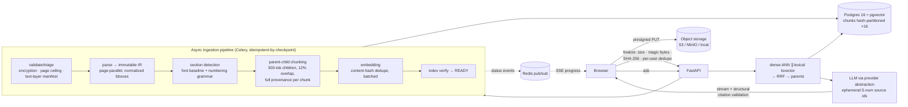

# Lexa — Large-Document Intelligence Platform

Upload a 500–1000-page PDF (contract, financial report, research paper), ask questions in plain
English, and get **streamed answers where every claim carries a clickable citation that jumps the
viewer to the exact page it came from**. Citations are never generated by the model — they are
resolved server-side from provenance captured at parse time.

**Phase 1 (MVP) is complete and demoable end-to-end**: upload → validate → parse → section
detection → chunking → embedding → indexing → hybrid retrieval → cited RAG answers → in-browser
PDF viewer with citation jumps.

- **What & why (architecture):** [`DESIGN.md`](DESIGN.md)
- **How it's built (hard invariants, pinned decisions, task plan):** [`CLAUDE.md`](CLAUDE.md)

## The demo path

Register → upload a PDF → watch live ingestion progress (SSE) → open the workspace → ask a
question → the answer streams in with `[S#]` citations rendered as page chips → click a chip →
the PDF.js viewer scrolls to the cited page.

## Architecture



## Engineering highlights

**Provenance-first citations (the core design bet).** Every chunk permanently carries
`page_start/end`, a list of normalized bboxes, global `char_start/end` into a canonical linearized
text stream, and its `section_path` — captured once at parse time, enforced by DB constraints
(`bboxes` must be a non-empty JSON array), and never reconstructed. Chunk content is literally
`linearized_text[char_start:char_end]`. Page-level citation jumps ship in Phase 1; bbox-precise
highlights are a Phase 2 overlay on data that already exists.

**The model never emits a citation.** Sources enter the prompt as ephemeral `[S#]` ids inside an
untrusted-data fence. A streaming filter structurally drops any `[S#]` outside the request's
source set — even when the bracket splits across stream chunks — and pages resolve server-side
from chunk metadata. A fabricated citation cannot reach the UI.

**Hybrid retrieval done honestly.** Dense ANN (pgvector HNSW, cosine) in parallel with lexical
search — Postgres `tsvector` in **two configs** (`english` stemmed + `simple` exact, because
defined terms and clause numbers must not be stemmed) — fused with Reciprocal Rank Fusion, which
consumes *ranks only*, so the arms never need score calibration. Matched children expand to their
parent chunks for context.

**Multi-tenant by construction.** Every query filters by the authenticated `user_id` and foreign
resources 404 (never 403 — no existence oracle). SHA-256 upload dedupe is scoped **per user**:
corpus-wide dedupe would be a cross-tenant existence side channel. Storage keys are
tenant-prefixed and ownership-verified at finalize.

**A pipeline that survives crashes.** Status transitions are guarded
(`UPDATE … WHERE status = expected` — stale transitions are no-ops), every stage is
idempotent-by-checkpoint (`UNIQUE (document_id, stage)` job rows carry JSONB checkpoints), Celery
runs `acks_late` with time and memory limits (a decompression-bomb PDF kills one task process, not
the fleet), and embedding resumes from `embedding IS NULL`. Documents flip to READY only after an
index-stage verification pass.

**Scale decisions made up front.** `chunks` is hash-partitioned by `document_id` (16 partitions,
composite PK) so single-document retrieval prunes to one partition instead of scanning the corpus.
Parsing is page-parallel across workers with per-batch checkpoints. Embeddings dedupe by content
hash before ever hitting the provider.

**Vendor isolation.** All LLM/embedding access goes through `app/providers/` (Anthropic + OpenAI
pinned, dimension-locked `vector(1536)`); deterministic fake providers make the entire test suite
run with **no network and no API keys** — including the tokenizer (the fake provider ships an
offline tokenizer; the OpenAI provider uses tiktoken `cl100k_base`).

**Operational hygiene.** SSE progress sends a DB snapshot first, then subscribes to Redis pub/sub
(with a post-subscribe re-read closing the gap, and DB-polling fallback if Redis dies). Auth is
argon2id + JWT with timing-equalized login. Rate limiting is Redis fixed-window with fail-open
in-memory fallback. Structured JSON logs carry request IDs end to end. CI runs ruff, strict mypy,
and the full test suite against real Postgres + pgvector, plus a frontend typecheck/build job.

## Stack

FastAPI (async) · SQLAlchemy 2 (async API / sync workers) · Alembic · Postgres 16 + pgvector ·
Celery + Redis · PyMuPDF · Anthropic + OpenAI behind a provider abstraction · Next.js (App
Router) + TypeScript + Tailwind · PDF.js · Docker Compose (Postgres, Redis, MinIO)

## Quickstart

```bash
# infra: Postgres 16 + pgvector, Redis, MinIO (bucket auto-created)
docker compose up -d
cp .env.example .env

# backend
uv sync
uv run alembic upgrade head
uv run uvicorn app.main:app --reload

# worker
uv run celery -A app.workers worker -l info

# frontend → http://localhost:3000
cd frontend && pnpm install && pnpm dev
```

No API keys? Set `LLM_PROVIDER=fake` and `EMBEDDING_PROVIDER=fake` in `.env` — the full demo path
works offline with deterministic providers.

```bash
# quality gate (same as CI)
uv run ruff check . && uv run mypy app/ && uv run pytest
cd frontend && pnpm typecheck && pnpm build
```

## Layout

```
app/
  api/        # routers only — thin, no business logic
  core/       # config, security, deps, exceptions, middleware, rate limiting, logging
  services/   # documents, chats + ingestion/ retrieval/ generation/ (business logic)
  models/     # SQLAlchemy ORM (users, documents, sections, chunks, jobs, chats, messages)
  schemas/    # Pydantic DTOs — the API contract (incl. the immutable BlockIR/PageIR)
  workers/    # Celery app + stage tasks (sync sessions, never the API's async engine)
  providers/  # llm/ embeddings/ — the ONLY place vendor SDKs are touched
  parsers/    # PDF parser interface + PyMuPDF impl (kept out of services/ by design)
  storage/    # object-storage interface + S3/MinIO + local adapters (tenant-prefixed keys)
  db/         # engines/sessions + Alembic migrations (incl. the partitioned-chunks DDL)
frontend/     # Next.js: auth, upload + SSE progress, PDF.js viewer, cited chat
tests/        # 80 tests: unit + DB-backed integration (throwaway migrated database)
```

## Phase 2 roadmap (designed for, deliberately not built)

Reranking · entailment-verified citations with abstain logic · bbox highlight overlays (the
provenance is already stored) · OCR fallback for scanned pages · the evaluation harness ·
semantic version diffing · Postgres RLS as defense-in-depth on top of app-layer tenancy ·
malware scanning at finalize. See `DESIGN.md` §12 and `CLAUDE.md` §6.
